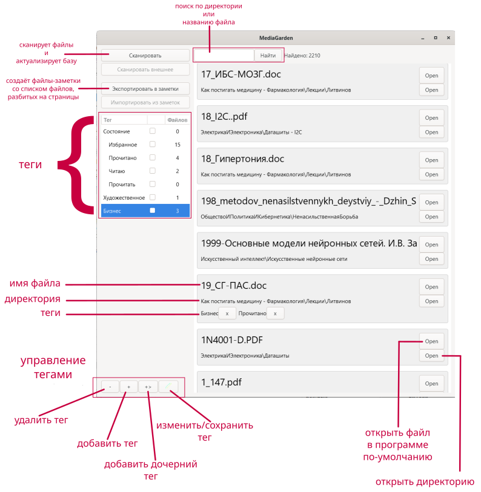
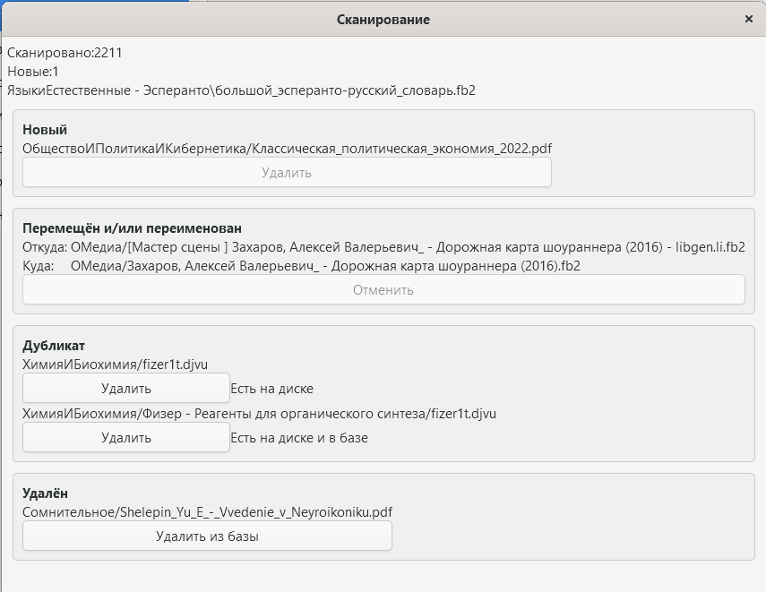

# MediaGarden - Сканер хранилища книг

Минимальная версия Python: 3.12

## Преимущества

1. MediaGarden не копирует файлы, потому что использует Вашу структуру файлов как хранилище.
1. MediaGarden не меняет структуру файлов, пока Вы явно не укажете сделать это.
1. Полноправно распоряжайтесь файлами на своём диске: переименовывайте, перемещайте. MediaGarden запоминает хеш файла, а не путь.

## Возможности

1. Помечайте книги тегами, фильтруйте по тегам.
1. Вручную переименовывайте и перемещайте файлы, добавляйте новые и удаляйте старые. Зайдите в MediaGarden и нажмите "Сканировать" - это актуализирует базу.
1. Создавайте заметки, открывайте их в Obsidian прямо из MediaGarden.
1. Открывайте файлы или директории во внешних программах прямо из MediaGarden 
1. Экспортируйте постраничный список книг в формате Markdown в Ваше хранилище заметок. Список удобно просматривать в Obsidian.
1. Экспортируйте список книг в формате CSV в Ваше хранилище заметок.
1. Импортируйте список книг в формате CSV в MediaGarden.

## Главное окно

Чтобы прикрепить тег к файлу - зажмите тег на имени и перетащите его на карточку файла.

Редактирование тегов:
- double-click по имени тега - переименование тега. Для применения изменений - нажмите Enter.

При двойном щелчке по названию книги - откроется окошко, в котором будет кнопка для открытия заметки о книге. Если заметки нет, то будет кнопка создания заметки.

Заметки расположены в хранилище заметок, представляют собой обычный текстовый файл.

## Окно сканирования

При сканировании файлов могут появится 4 варианта карточек, сообщающие об изменениях в структуре файлов, например, если вы что меняли вручную.

MediaGarden допускает, что Вы можете переименовать файл и/или переместить его в пределах директории хранилища. При этом все привязанные теги останутся по-прежнему привязанными к файлу.

## Особенности поведения

1. Удалённые с диска файлы удаляются из базы данных. При добавлении вновь он изменит свой идентификатор, что сделает в заметках ссылки на него невалидными.
2. Если изменить файл, то он воспримется как новый, а файл с хешем старой версии будет считаться удалённой, оставаясь при этом в базе.
3. Поиск кириллических символов - регистрозависимый, латинских - регистронезависимый.
4. О завершении сканирования программа сообщит в консоль.
5. Программа в директории заметок может создавать список книг и заметки о книгах.

# Подготовка к запуску

Установите зависимости:
- `python pip install -r requirements.txt`

Примените миграции:
- `python src/manage.py migrate`

# Запуск

Для запуска MediaGarden перейдите в директорию репозиотрия и выполните:
- `python src/gui.py`

## Контакты

По всем вопросам пишите в Telegram: https://t.me/sy_mediagarden
